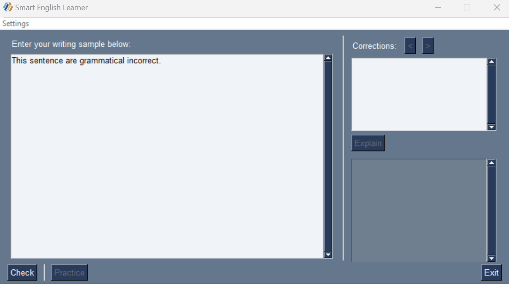

# Smart English Learner 
Smart English Learner is a tool designed to help non-native English speakers elevate their professional English.
- Error correction
- Simple and comprehensive explanations
- Practice & improve on the mistakes you made
- Generates new sentences based on your grammatical errors



## Setup
### Installation
1. [Install Python](https://www.python.org/downloads/) (tested on Python 3.9.7)
2. Install the requirements
```
$ pip install -r requirements.txt
```
### Get an OpenAI API Key
\* You will need to set up a paid account after your 30-day free trial expires. [(See: Estimated Costs)](#estimated-costs)
1. [Create an OpenAI account](https://platform.openai.com/)
2. [Create an API key](https://platform.openai.com/account/api-keys)
3. Store it somewhere safe
### Usage
1. Run display.py
```
$ python display.py
```
2. Paste in your API key
3. Type or paste in a writing sample
4. See corrections
5. Get each error explained
6. Practice on those same errors
7. Elevate your English!

## Estimated Costs
Per session:
- Grammar Check: $0.0015 (0.15¢)
- Check + Explain: $0.0029 (0.29¢)
- Practice: $0.058 (5.8¢)
- Total (Check + Explain + Practice): $0.061 (6.1¢)

## Planned Improvements
- Add multilingual support
- Make user profiles