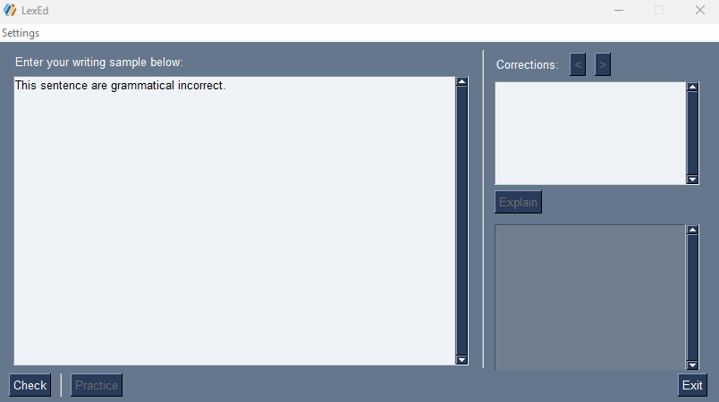
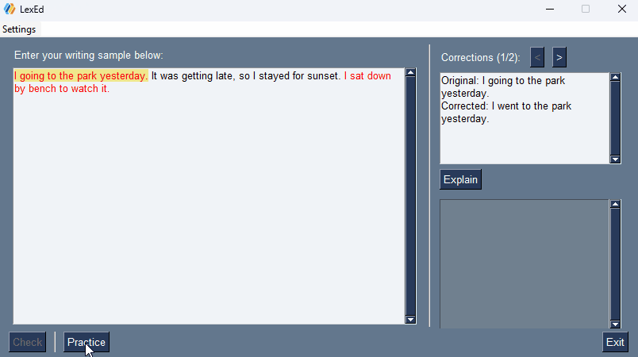

# LexEd 
LexEd is a tool designed to help non-native English speakers elevate their professional English. LexEd corrects, explains, and creates practice problems on your common errors — all in one app.

## Why LexEd?
- **More** than just a spell-checker
- Helps users **practice** on common mistakes
- Cutting-edge AI technology generates **personalized** practice problems
- **Novel method** generates new sentences based on past grammatical errors
- Two-stage practice mode **mimics editing process**
- Designed for **improvement**, not reliance




## Setup
### Installation
1. [Install Python](https://www.python.org/downloads/) (tested on Python 3.9.7)
2. Clone the repository
```
$ git clone https://github.com/CChenalds17/LexEd
```
3. Install the requirements
```
$ pip install -r LexEd/requirements.txt
```
### Get an OpenAI API Key
\* You will need to set up a paid account after your 30-day free trial expires. [(See: Estimated Costs)](#estimated-costs)
1. [Create an OpenAI account](https://platform.openai.com/)
2. [Create an API key](https://platform.openai.com/account/api-keys)
3. Store it somewhere safe
### Usage
1. Run display.py
```
$ python display.py
```
2. Paste in your API key
3. Type or paste in a writing sample
4. See corrections
5. Get each error explained
6. Practice on those same errors
7. Elevate your English!

## Estimated Costs
### Overall Costs (depending on usage)
- $0.061 (6.1¢) per session
- $0.50 (50¢) per week
- $2.00 per month
### Cost Breakdown
Per session:
- Grammar Check: $0.0015 (0.15¢)
- Check + Explain: $0.0029 (0.29¢)
- Practice: $0.058 (5.8¢)
- Total (Check + Explain + Practice): $0.061 (6.1¢)

## Planned Improvements
- Add multilingual support
- Make user profiles
- Update algorithm to check for flow